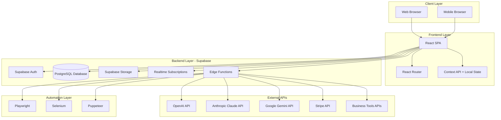
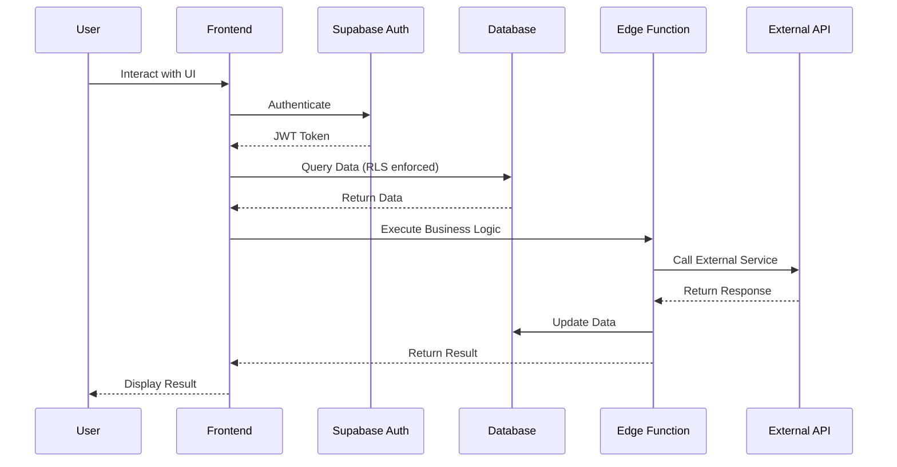
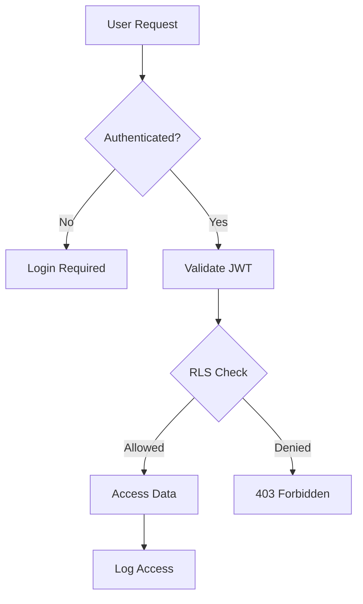
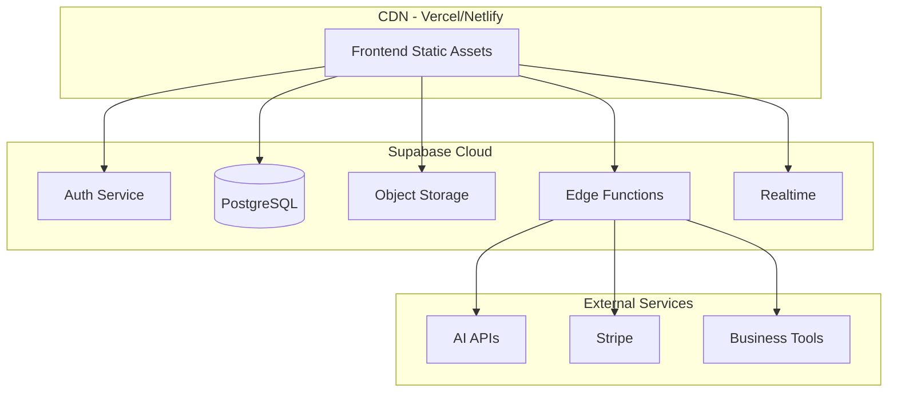
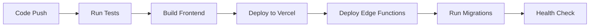

# Technical Specification - AI Super Assistant Platform

**Version:** 1.0  
**Date:** 2025-10-29  
**Status:** Production-Ready

---

## Table of Contents

1. [System Architecture](#1-system-architecture)
2. [Technology Stack](#2-technology-stack)
3. [Database Schema](#3-database-schema)
4. [API Endpoints](#4-api-endpoints)
5. [Security Architecture](#5-security-architecture)
6. [Integration Points](#6-integration-points)
7. [Deployment Architecture](#7-deployment-architecture)
8. [Scalability Considerations](#8-scalability-considerations)
9. [Technical Requirements](#9-technical-requirements)

---

## 1. System Architecture

### 1.1 High-Level Architecture



### 1.2 Component Architecture

**Frontend Components:**
- **Authentication Module**: Login, signup, password reset, MFA
- **Dashboard Module**: Overview, metrics, activity feed
- **AI Chat Module**: Multi-model chat interface, conversation history
- **Automation Module**: Browser automation controls, workflow builder
- **IT Support Module**: Ticket management, system monitoring
- **Business Management Module**: Client management, billing, analytics
- **Settings Module**: User preferences, integrations, API keys

**Backend Services (Edge Functions):**
- **AI Service**: Multi-model routing, conversation memory, context management
- **Automation Service**: Browser automation execution, scheduling
- **Support Service**: Ticket creation, assignment, SLA tracking
- **Business Service**: Client management, billing, analytics
- **Integration Service**: External API integrations, webhooks

### 1.3 Data Flow



---

## 2. Technology Stack

### 2.1 Frontend Stack

| Layer | Technology | Version | Purpose |
|-------|-----------|---------|---------|
| **Framework** | React | 18.2+ | UI framework |
| **Language** | TypeScript | 5.0+ | Type safety |
| **Build Tool** | Vite | 5.0+ | Fast builds and HMR |
| **Styling** | Tailwind CSS | 3.4+ | Utility-first CSS |
| **Routing** | React Router | 6.20+ | Client-side routing |
| **State Management** | Context API + Hooks | - | Global state |
| **Forms** | React Hook Form | 7.49+ | Form validation |
| **UI Components** | Custom + Headless UI | - | Accessible components |
| **Icons** | Lucide React | Latest | Icon library |
| **Charts** | Recharts | 2.10+ | Data visualization |
| **Date/Time** | date-fns | Latest | Date manipulation |

### 2.2 Backend Stack (Supabase)

| Service | Technology | Purpose |
|---------|-----------|---------|
| **Database** | PostgreSQL 15+ | Primary data store |
| **Authentication** | Supabase Auth | User management, JWT |
| **Storage** | Supabase Storage | File uploads |
| **Realtime** | Supabase Realtime | Live subscriptions |
| **Edge Functions** | Deno Runtime | Serverless functions |
| **Row-Level Security** | PostgreSQL RLS | Data access control |

### 2.3 External Integrations

| Category | APIs | Purpose |
|----------|------|---------|
| **AI Models** | OpenAI, Anthropic, Google AI | Multi-model AI chat |
| **Browser Automation** | Playwright, Selenium, Puppeteer | Web automation |
| **Payments** | Stripe | Billing and subscriptions |
| **CRM** | Salesforce, HubSpot | Customer management |
| **Project Management** | Asana, Jira | Task tracking |
| **Communication** | Slack, Microsoft Teams | Team collaboration |
| **Accounting** | QuickBooks, Xero | Financial management |

---

## 3. Database Schema

### 3.1 Core Tables

#### users
```sql
CREATE TABLE users (
  id UUID PRIMARY KEY DEFAULT uuid_generate_v4(),
  email TEXT UNIQUE NOT NULL,
  full_name TEXT,
  avatar_url TEXT,
  organization_id UUID REFERENCES organizations(id),
  role TEXT DEFAULT 'member',
  created_at TIMESTAMP WITH TIME ZONE DEFAULT NOW(),
  updated_at TIMESTAMP WITH TIME ZONE DEFAULT NOW()
);
```

#### organizations
```sql
CREATE TABLE organizations (
  id UUID PRIMARY KEY DEFAULT uuid_generate_v4(),
  name TEXT NOT NULL,
  subscription_tier TEXT DEFAULT 'free',
  subscription_status TEXT DEFAULT 'active',
  billing_email TEXT,
  created_at TIMESTAMP WITH TIME ZONE DEFAULT NOW(),
  updated_at TIMESTAMP WITH TIME ZONE DEFAULT NOW()
);
```

#### conversations
```sql
CREATE TABLE conversations (
  id UUID PRIMARY KEY DEFAULT uuid_generate_v4(),
  user_id UUID REFERENCES users(id) ON DELETE CASCADE,
  title TEXT,
  model TEXT, -- openai, claude, gemini
  context JSONB DEFAULT '{}',
  created_at TIMESTAMP WITH TIME ZONE DEFAULT NOW(),
  updated_at TIMESTAMP WITH TIME ZONE DEFAULT NOW()
);
```

#### messages
```sql
CREATE TABLE messages (
  id UUID PRIMARY KEY DEFAULT uuid_generate_v4(),
  conversation_id UUID REFERENCES conversations(id) ON DELETE CASCADE,
  role TEXT NOT NULL, -- user, assistant, system
  content TEXT NOT NULL,
  model TEXT,
  tokens_used INTEGER,
  created_at TIMESTAMP WITH TIME ZONE DEFAULT NOW()
);
```

#### automation_tasks
```sql
CREATE TABLE automation_tasks (
  id UUID PRIMARY KEY DEFAULT uuid_generate_v4(),
  user_id UUID REFERENCES users(id) ON DELETE CASCADE,
  organization_id UUID REFERENCES organizations(id),
  name TEXT NOT NULL,
  description TEXT,
  type TEXT NOT NULL, -- scraping, testing, form_fill
  framework TEXT, -- playwright, selenium, puppeteer
  script JSONB NOT NULL,
  schedule TEXT, -- cron expression
  status TEXT DEFAULT 'draft', -- draft, active, paused
  last_run_at TIMESTAMP WITH TIME ZONE,
  next_run_at TIMESTAMP WITH TIME ZONE,
  created_at TIMESTAMP WITH TIME ZONE DEFAULT NOW(),
  updated_at TIMESTAMP WITH TIME ZONE DEFAULT NOW()
);
```

#### automation_runs
```sql
CREATE TABLE automation_runs (
  id UUID PRIMARY KEY DEFAULT uuid_generate_v4(),
  task_id UUID REFERENCES automation_tasks(id) ON DELETE CASCADE,
  status TEXT NOT NULL, -- running, completed, failed
  result JSONB,
  error TEXT,
  duration_ms INTEGER,
  started_at TIMESTAMP WITH TIME ZONE DEFAULT NOW(),
  completed_at TIMESTAMP WITH TIME ZONE
);
```

#### support_tickets
```sql
CREATE TABLE support_tickets (
  id UUID PRIMARY KEY DEFAULT uuid_generate_v4(),
  organization_id UUID REFERENCES organizations(id),
  client_id UUID REFERENCES clients(id),
  title TEXT NOT NULL,
  description TEXT,
  priority TEXT DEFAULT 'medium', -- low, medium, high, critical
  status TEXT DEFAULT 'open', -- open, in_progress, waiting, resolved, closed
  assigned_to UUID REFERENCES users(id),
  category TEXT,
  tags TEXT[],
  created_by UUID REFERENCES users(id),
  created_at TIMESTAMP WITH TIME ZONE DEFAULT NOW(),
  updated_at TIMESTAMP WITH TIME ZONE DEFAULT NOW(),
  resolved_at TIMESTAMP WITH TIME ZONE,
  closed_at TIMESTAMP WITH TIME ZONE
);
```

#### ticket_comments
```sql
CREATE TABLE ticket_comments (
  id UUID PRIMARY KEY DEFAULT uuid_generate_v4(),
  ticket_id UUID REFERENCES support_tickets(id) ON DELETE CASCADE,
  user_id UUID REFERENCES users(id),
  content TEXT NOT NULL,
  is_internal BOOLEAN DEFAULT false,
  attachments JSONB DEFAULT '[]',
  created_at TIMESTAMP WITH TIME ZONE DEFAULT NOW()
);
```

#### clients
```sql
CREATE TABLE clients (
  id UUID PRIMARY KEY DEFAULT uuid_generate_v4(),
  organization_id UUID REFERENCES organizations(id),
  name TEXT NOT NULL,
  email TEXT,
  phone TEXT,
  company TEXT,
  status TEXT DEFAULT 'active', -- active, inactive, archived
  billing_info JSONB DEFAULT '{}',
  custom_fields JSONB DEFAULT '{}',
  created_at TIMESTAMP WITH TIME ZONE DEFAULT NOW(),
  updated_at TIMESTAMP WITH TIME ZONE DEFAULT NOW()
);
```

#### projects
```sql
CREATE TABLE projects (
  id UUID PRIMARY KEY DEFAULT uuid_generate_v4(),
  organization_id UUID REFERENCES organizations(id),
  client_id UUID REFERENCES clients(id),
  name TEXT NOT NULL,
  description TEXT,
  status TEXT DEFAULT 'planning', -- planning, active, on_hold, completed, archived
  budget DECIMAL(10,2),
  spent DECIMAL(10,2) DEFAULT 0,
  start_date DATE,
  end_date DATE,
  created_at TIMESTAMP WITH TIME ZONE DEFAULT NOW(),
  updated_at TIMESTAMP WITH TIME ZONE DEFAULT NOW()
);
```

#### invoices
```sql
CREATE TABLE invoices (
  id UUID PRIMARY KEY DEFAULT uuid_generate_v4(),
  organization_id UUID REFERENCES organizations(id),
  client_id UUID REFERENCES clients(id),
  project_id UUID REFERENCES projects(id),
  invoice_number TEXT UNIQUE NOT NULL,
  amount DECIMAL(10,2) NOT NULL,
  tax DECIMAL(10,2) DEFAULT 0,
  total DECIMAL(10,2) NOT NULL,
  status TEXT DEFAULT 'draft', -- draft, sent, paid, overdue, cancelled
  due_date DATE,
  paid_date DATE,
  line_items JSONB DEFAULT '[]',
  created_at TIMESTAMP WITH TIME ZONE DEFAULT NOW(),
  updated_at TIMESTAMP WITH TIME ZONE DEFAULT NOW()
);
```

#### system_monitors
```sql
CREATE TABLE system_monitors (
  id UUID PRIMARY KEY DEFAULT uuid_generate_v4(),
  organization_id UUID REFERENCES organizations(id),
  name TEXT NOT NULL,
  type TEXT NOT NULL, -- uptime, performance, resource
  target_url TEXT,
  config JSONB DEFAULT '{}',
  status TEXT DEFAULT 'active',
  last_check_at TIMESTAMP WITH TIME ZONE,
  last_status TEXT,
  created_at TIMESTAMP WITH TIME ZONE DEFAULT NOW(),
  updated_at TIMESTAMP WITH TIME ZONE DEFAULT NOW()
);
```

#### monitor_alerts
```sql
CREATE TABLE monitor_alerts (
  id UUID PRIMARY KEY DEFAULT uuid_generate_v4(),
  monitor_id UUID REFERENCES system_monitors(id) ON DELETE CASCADE,
  severity TEXT NOT NULL, -- info, warning, critical
  message TEXT NOT NULL,
  details JSONB DEFAULT '{}',
  resolved BOOLEAN DEFAULT false,
  created_at TIMESTAMP WITH TIME ZONE DEFAULT NOW(),
  resolved_at TIMESTAMP WITH TIME ZONE
);
```

#### workflows
```sql
CREATE TABLE workflows (
  id UUID PRIMARY KEY DEFAULT uuid_generate_v4(),
  organization_id UUID REFERENCES organizations(id),
  name TEXT NOT NULL,
  description TEXT,
  trigger_type TEXT NOT NULL, -- manual, schedule, webhook, event
  trigger_config JSONB DEFAULT '{}',
  steps JSONB NOT NULL,
  status TEXT DEFAULT 'active',
  created_by UUID REFERENCES users(id),
  created_at TIMESTAMP WITH TIME ZONE DEFAULT NOW(),
  updated_at TIMESTAMP WITH TIME ZONE DEFAULT NOW()
);
```

#### workflow_executions
```sql
CREATE TABLE workflow_executions (
  id UUID PRIMARY KEY DEFAULT uuid_generate_v4(),
  workflow_id UUID REFERENCES workflows(id) ON DELETE CASCADE,
  status TEXT NOT NULL, -- running, completed, failed
  input JSONB,
  output JSONB,
  error TEXT,
  started_at TIMESTAMP WITH TIME ZONE DEFAULT NOW(),
  completed_at TIMESTAMP WITH TIME ZONE
);
```

#### api_keys
```sql
CREATE TABLE api_keys (
  id UUID PRIMARY KEY DEFAULT uuid_generate_v4(),
  organization_id UUID REFERENCES organizations(id),
  user_id UUID REFERENCES users(id),
  name TEXT NOT NULL,
  key_hash TEXT NOT NULL UNIQUE,
  prefix TEXT NOT NULL,
  permissions JSONB DEFAULT '{}',
  last_used_at TIMESTAMP WITH TIME ZONE,
  expires_at TIMESTAMP WITH TIME ZONE,
  created_at TIMESTAMP WITH TIME ZONE DEFAULT NOW()
);
```

#### audit_logs
```sql
CREATE TABLE audit_logs (
  id UUID PRIMARY KEY DEFAULT uuid_generate_v4(),
  organization_id UUID REFERENCES organizations(id),
  user_id UUID REFERENCES users(id),
  action TEXT NOT NULL,
  resource_type TEXT,
  resource_id UUID,
  details JSONB DEFAULT '{}',
  ip_address TEXT,
  user_agent TEXT,
  created_at TIMESTAMP WITH TIME ZONE DEFAULT NOW()
);
```

### 3.2 Indexes

```sql
-- Performance indexes
CREATE INDEX idx_messages_conversation ON messages(conversation_id);
CREATE INDEX idx_messages_created_at ON messages(created_at DESC);
CREATE INDEX idx_tickets_organization ON support_tickets(organization_id);
CREATE INDEX idx_tickets_status ON support_tickets(status);
CREATE INDEX idx_tickets_assigned ON support_tickets(assigned_to);
CREATE INDEX idx_clients_organization ON clients(organization_id);
CREATE INDEX idx_projects_client ON projects(client_id);
CREATE INDEX idx_automation_tasks_user ON automation_tasks(user_id);
CREATE INDEX idx_automation_runs_task ON automation_runs(task_id);
CREATE INDEX idx_audit_logs_organization ON audit_logs(organization_id);
CREATE INDEX idx_audit_logs_created_at ON audit_logs(created_at DESC);
```

### 3.3 Row-Level Security (RLS) Policies

All tables have RLS enabled with policies ensuring:
- Users can only access data within their organization
- Role-based access control (admin, manager, member, client)
- Audit logging for all sensitive operations
- Secure client portal access

---

## 4. API Endpoints

### 4.1 Authentication Endpoints

| Endpoint | Method | Description |
|----------|--------|-------------|
| `/auth/signup` | POST | User registration |
| `/auth/login` | POST | User authentication |
| `/auth/logout` | POST | End user session |
| `/auth/reset-password` | POST | Password reset request |
| `/auth/update-password` | PUT | Update password |

### 4.2 AI Chat Endpoints

| Endpoint | Method | Description |
|----------|--------|-------------|
| `/api/conversations` | GET | List user conversations |
| `/api/conversations` | POST | Create new conversation |
| `/api/conversations/:id` | GET | Get conversation details |
| `/api/conversations/:id` | DELETE | Delete conversation |
| `/api/messages` | POST | Send message to AI |
| `/api/models` | GET | List available AI models |

### 4.3 Browser Automation Endpoints

| Endpoint | Method | Description |
|----------|--------|-------------|
| `/api/automation/tasks` | GET | List automation tasks |
| `/api/automation/tasks` | POST | Create automation task |
| `/api/automation/tasks/:id` | GET | Get task details |
| `/api/automation/tasks/:id` | PUT | Update task |
| `/api/automation/tasks/:id/execute` | POST | Execute task |
| `/api/automation/runs` | GET | List task runs |
| `/api/automation/runs/:id` | GET | Get run details |

### 4.4 IT Support Endpoints

| Endpoint | Method | Description |
|----------|--------|-------------|
| `/api/tickets` | GET | List support tickets |
| `/api/tickets` | POST | Create ticket |
| `/api/tickets/:id` | GET | Get ticket details |
| `/api/tickets/:id` | PUT | Update ticket |
| `/api/tickets/:id/comments` | POST | Add comment |
| `/api/monitors` | GET | List system monitors |
| `/api/monitors` | POST | Create monitor |
| `/api/alerts` | GET | List alerts |

### 4.5 Business Management Endpoints

| Endpoint | Method | Description |
|----------|--------|-------------|
| `/api/clients` | GET | List clients |
| `/api/clients` | POST | Create client |
| `/api/clients/:id` | PUT | Update client |
| `/api/projects` | GET | List projects |
| `/api/projects` | POST | Create project |
| `/api/invoices` | GET | List invoices |
| `/api/invoices` | POST | Create invoice |
| `/api/analytics` | GET | Get business analytics |

### 4.6 Workflow Automation Endpoints

| Endpoint | Method | Description |
|----------|--------|-------------|
| `/api/workflows` | GET | List workflows |
| `/api/workflows` | POST | Create workflow |
| `/api/workflows/:id/execute` | POST | Execute workflow |
| `/api/integrations` | GET | List integrations |
| `/api/webhooks` | POST | Webhook receiver |

---

## 5. Security Architecture

### 5.1 Authentication & Authorization



**Security Measures:**
- JWT-based authentication with secure httpOnly cookies
- Row-Level Security (RLS) on all database tables
- Role-Based Access Control (RBAC)
- Multi-Factor Authentication (MFA) support
- API key authentication for programmatic access
- Rate limiting on all endpoints
- CORS configuration for trusted domains only

### 5.2 Data Protection

- **Encryption at Rest**: All data encrypted in PostgreSQL database
- **Encryption in Transit**: HTTPS/TLS 1.3 for all connections
- **Sensitive Data**: API keys, passwords hashed with bcrypt
- **PII Protection**: GDPR and CCPA compliance measures
- **Backup Encryption**: All backups encrypted

### 5.3 API Security

- Rate limiting: 100 requests/minute per user
- Request validation and sanitization
- SQL injection prevention via parameterized queries
- XSS protection via Content Security Policy
- CSRF protection for state-changing operations

### 5.4 Compliance

- **GDPR**: Data portability, right to deletion, consent management
- **SOC 2 Type II**: via Supabase infrastructure
- **HIPAA Ready**: Available with enterprise plan
- **ISO 27001**: Information security management

---

## 6. Integration Points

### 6.1 AI Model Integrations

**OpenAI Integration:**
- Models: GPT-4, GPT-3.5-turbo
- Features: Chat completion, function calling, embeddings
- Authentication: API key via edge function environment variables

**Anthropic Claude Integration:**
- Models: Claude-3-opus, Claude-3-sonnet, Claude-3-haiku
- Features: Long context (200K tokens), function calling
- Authentication: API key via edge function environment variables

**Google Gemini Integration:**
- Models: Gemini-pro, Gemini-pro-vision
- Features: Multimodal, grounding with Google Search
- Authentication: API key via edge function environment variables

### 6.2 Browser Automation Integrations

**Playwright:**
- Languages: TypeScript, Python
- Browsers: Chromium, Firefox, WebKit
- Features: Auto-waiting, network interception, screenshots

**Selenium:**
- Languages: Python, Java, JavaScript
- Browsers: Chrome, Firefox, Safari, Edge
- Features: WebDriver, Grid support

**Puppeteer:**
- Languages: JavaScript/TypeScript
- Browser: Chrome/Chromium
- Features: Headless mode, PDF generation, network control

### 6.3 Business Tool Integrations

**CRM Systems:**
- Salesforce: REST API, OAuth 2.0
- HubSpot: REST API, OAuth 2.0

**Project Management:**
- Asana: REST API, webhooks
- Jira: REST API v3, webhooks

**Communication:**
- Slack: Web API, Events API, OAuth 2.0
- Microsoft Teams: Graph API, webhooks

**Accounting:**
- QuickBooks Online: REST API, OAuth 2.0
- Xero: REST API, OAuth 2.0

### 6.4 Payment Integration

**Stripe:**
- Products: Subscriptions, one-time payments
- Features: Webhooks for payment events, customer portal
- Security: PCI DSS compliant

---

## 7. Deployment Architecture

### 7.1 Infrastructure Overview



### 7.2 Environment Configuration

**Development:**
- Local Vite dev server
- Supabase local development
- Environment variables in `.env.local`

**Staging:**
- Deployed to Vercel/Netlify preview
- Supabase staging project
- Separate database and storage

**Production:**
- Deployed to Vercel/Netlify production
- Supabase production project
- Automated backups and monitoring

### 7.3 CI/CD Pipeline



**Pipeline Steps:**
1. Code push triggers GitHub Actions
2. Run unit tests and integration tests
3. Build frontend with Vite
4. Deploy to Vercel/Netlify
5. Deploy Supabase edge functions
6. Run database migrations
7. Run health checks
8. Notify team on Slack

---

## 8. Scalability Considerations

### 8.1 Database Scalability

**Current Capacity:**
- Supabase Free Tier: 500MB database, 1GB storage
- Pro Tier: 8GB database, 100GB storage
- Enterprise: Custom sizing

**Scaling Strategies:**
- Connection pooling via PgBouncer
- Read replicas for analytics queries
- Partitioning for large tables (audit_logs, messages)
- Archiving old data to cold storage

### 8.2 API Scalability

**Edge Functions:**
- Auto-scaling based on load
- Regional distribution
- Cold start optimization

**Rate Limiting:**
- Per-user limits
- Per-organization limits
- Graceful degradation under load

### 8.3 Frontend Scalability

**Performance Optimizations:**
- Code splitting and lazy loading
- Image optimization
- CDN caching
- Service worker for offline support

**Monitoring:**
- Real User Monitoring (RUM)
- Core Web Vitals tracking
- Error tracking with Sentry

### 8.4 Cost Optimization

**Database:**
- Index optimization
- Query optimization
- Archiving old data

**Storage:**
- Image compression
- CDN for static assets
- Object lifecycle policies

**API Usage:**
- Caching responses
- Batch operations
- Connection pooling

---

## 9. Technical Requirements

### 9.1 System Requirements

**Supported Browsers:**
- Chrome/Edge 90+
- Firefox 88+
- Safari 14+

**Mobile Support:**
- iOS Safari 14+
- Chrome Mobile 90+

### 9.2 Development Requirements

**Required Tools:**
- Node.js 18+
- npm/yarn/pnpm
- Git
- Supabase CLI
- Code editor (VS Code recommended)

**Optional Tools:**
- Docker (for local Supabase)
- PostgreSQL client
- Postman/Insomnia (API testing)

### 9.3 Performance Requirements

| Metric | Target | Critical |
|--------|--------|----------|
| Page Load Time | <2s | <3s |
| Time to Interactive | <3s | <5s |
| API Response Time | <500ms | <1s |
| Database Query Time | <100ms | <500ms |
| Edge Function Cold Start | <1s | <2s |

### 9.4 Availability Requirements

- **Uptime SLA**: 99.9% (Production)
- **Backup Frequency**: Daily automated backups
- **Recovery Time Objective (RTO)**: <4 hours
- **Recovery Point Objective (RPO)**: <24 hours

---

## Appendix A: Technology Decisions

**Why React?**
- Large ecosystem and community
- Component reusability
- Strong TypeScript support
- Proven at scale

**Why Supabase?**
- PostgreSQL-based (proven RDBMS)
- Built-in authentication and RLS
- Real-time capabilities
- Edge functions for serverless logic
- Cost-effective at scale

**Why Tailwind CSS?**
- Rapid development
- Consistent design system
- Small bundle size with PurgeCSS
- Excellent documentation

**Why Vite?**
- Fast development server
- Optimized production builds
- Built-in TypeScript support
- Modern ESM-based architecture

---

## Appendix B: Glossary

- **RLS**: Row-Level Security
- **JWT**: JSON Web Token
- **RBAC**: Role-Based Access Control
- **SLA**: Service Level Agreement
- **RTO**: Recovery Time Objective
- **RPO**: Recovery Point Objective
- **CDN**: Content Delivery Network
- **CMDB**: Configuration Management Database
- **MFA**: Multi-Factor Authentication

---

**Document Version History:**

| Version | Date | Author | Changes |
|---------|------|--------|---------|
| 1.0 | 2025-10-29 | MiniMax Agent | Initial technical specification |

---

**References:**
- Supabase Documentation: https://supabase.com/docs
- React Documentation: https://react.dev
- Tailwind CSS Documentation: https://tailwindcss.com
- Vite Documentation: https://vitejs.dev
